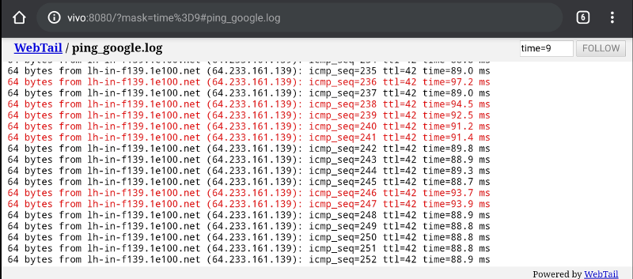

# webtail

> Публикация изменений (журнальных) файлов через websocket

<p align="center">
  <a href="README.md#readme">English</a> |
  <span>Pусский</span> |
  <a href="README.ja.md#readme">日本語</a>
</p>

---

[![Go Reference][ref1]][ref2]
 [![GitHub Release][gr1]][gr2]
 [![Build Status][bs1]][bs2]
 [![GitHub license][gl1]][gl2]

[![codecov][cc1]][cc2]
 [![Test Coverage][cct1]][cct2]
 [![Maintainability][ccm1]][ccm2]
 [![GoCard][gc1]][gc2]

[cct1]: https://api.codeclimate.com/v1/badges/909eca87d9ee5b216a6b/test_coverage
[cct2]: https://codeclimate.com/github/LeKovr/webtail/test_coverage
[ccm1]: https://api.codeclimate.com/v1/badges/909eca87d9ee5b216a6b/maintainability
[ccm2]: https://codeclimate.com/github/LeKovr/webtail/maintainability
[ref1]: https://pkg.go.dev/badge/github.com/LeKovr/webtail.svg
[ref2]: https://pkg.go.dev/github.com/LeKovr/webtail
[cc1]: https://codecov.io/gh/LeKovr/webtail/branch/master/graph/badge.svg
[cc2]: https://codecov.io/gh/LeKovr/webtail
[gc1]: https://goreportcard.com/badge/github.com/LeKovr/webtail
[gc2]: https://goreportcard.com/report/github.com/LeKovr/webtail
[bs1]: https://github.com/LeKovr/webtail/actions/workflows/docker-publish.yml/badge.svg
[bs2]: http://github.com/LeKovr/webtail/actions/workflows/docker-publish.yml
[gr1]: https://img.shields.io/github/release/LeKovr/webtail.svg
[gr2]: https://github.com/LeKovr/webtail/releases
[gl1]: https://img.shields.io/github/license/LeKovr/webtail.svg
[gl2]: https://github.com/LeKovr/webtail/blob/master/LICENSE

[webtail](https://github.com/LeKovr/webtail) - это веб-сервис и golang-пакет, предназначенные для публикации изменений постоянно дополняемых файлов (например - журналов) по протоколу websocket с доступом через браузер.



## Установка

```sh
go get -v github.com/LeKovr/webtail/...
```

### Бинарные пакеты

См. [Файлы релиза](https://github.com/LeKovr/webtail/releases/latest)

### Docker

Начиная с версии 0.43.2 образы docker публикуются в [Реестре контейнеров GitHub](https://ghcr.io), для их получения используется команда

```sh
docker pull ghcr.io/lekovr/webtail:latest
```

См. также: пример использования в [docker-compose.yml](docker-compose.yml).

Версия 0.43.1 - последняя из [доступных на hub.docker.com](https://hub.docker.com/repository/docker/lekovr/webtail/tags).

## Использование webtail в своем приложении

```go
package main
import (
    "github.com/LeKovr/webtail"
)

func main() {
    wt, err := webtail.New(log, cfg)
    if err != nil {
        return
    }
    go wt.Run()
    defer wt.Close()
    // ...
    http.Handle("/tail", wt)
}
```

См. также: [app.go](https://github.com/LeKovr/webtail/blob/master/cmd/webtail/app.go)

## Примечание про gorilla/websocket

Начиная с версии 0.30 проект основан на [примере чата от gorilla/websocket](https://github.com/gorilla/websocket/tree/master/examples/chat). См [client.go](client.go)

## Лицензия

Исходный код проекта лицензирован под MIT, см [LICENSE](LICENSE).

Copyright (c) 2016-2021 Алексей Коврижкин <lekovr+webtail@gmail.com>
